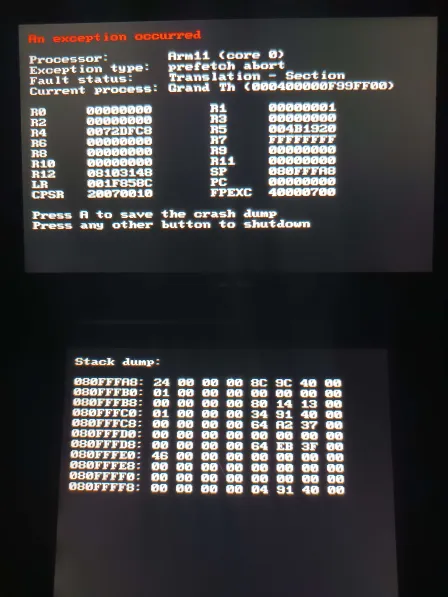

# ❌ Errores Luma 3ds

### Que es un error Luma

Hay que saber que estos errores no son de Luma, sino que este mismo nos protege de que nuestra consola sufra de algún problema. Estos errores tienen este aspecto:\

<figure><figcaption></figcaption></figure>

## Tipos de errores y su solución

### Arm11 (core 0)

La aparición de este error se debe a la sd \[ruta 0]

Es posible que al usar algún homebrew que usa la sd se hallan introducido algún archivo corrupto en la sd, lo que hace que salga ese error y posiblemente la corrupción de la tarjeta SD.

SOLUCIONES:\
Eliminar los archivos corruptos y formatear la sd si hace falta. Si se han perdido los archivos de arranque, recuperarlos.

### Arm 11 (core 1)

Es el error más común, es muy peligroso y puede llegar a brikear la consola.

**PUEDE APARECER POR:**

1. Instalación QR FBI de un .cia fallida.
2. Ejecución de Archivo.cia `corrupto`&#x20;

2.1 También puede deberse a que el juego y la actualización no son de la misma región

4. Cualquier ejecución que genere sobreesfuerzo al núcleo:

4.1 Algunos Trucos de juegos

### Otros errores

Existen más errores, pero para no hacer está guiá muy larga, preguntanós en nuestro Discord para que te resolvamos tus dudas.

