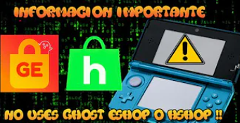

# 🔮 Homebrew apps

## ¡ADVERTENCIA!

Las aplicaciones de Hshop (3hs) y Gosht Eshop (UniStore) P**UEDEN CORROMPER LA CONSOLA Y NO SE RECOMIENDAN BAJO NINGÚN CONCEPTO. Además, son piratería y no está bien usarlas. No confundir 3hs con la web de Hshop (esa sigue siendo ilegal pero no corrompe)**

<figure><figcaption></figcaption></figure>

### Las aplicaciones más interesantes para 3DS

* **Anemone 3ds**: Aplicación que sirve para cambiar los temas de la consola ([https://github.com/astronautlevel2/Anemone3DS/releases](https://github.com/astronautlevel2/Anemone3DS/releases))
* **Chekpoint**: Aplicación que sirve para hacer respaldos y poner trucos a los juegos ([https://github.com/FlagBrew/Checkpoint/releases](https://github.com/FlagBrew/Checkpoint/releases))
* **FTPD**: Transmite archivos desde un dispositivo a la 3ds, se precisa de un programa ftp (Filezilla), muy útil para consolas New 3ds xd ([https://github.com/mtheall/ftpd/releases](https://github.com/mtheall/ftpd/releases))
* **Homebrew Launcher**: En las etapas tempranas del hack era muy útil, hoy en día no se usa debido a los .cia y al FBI ([https://github.com/devkitPro/3ds-hbmenu/releases](https://github.com/devkitPro/3ds-hbmenu/releases))
* **Wumiibo**: Permite emular Amiibos ([https://github.com/hax0kartik/wumiibo/releases](https://github.com/hax0kartik/wumiibo/releases))
* **FBI**: Programa para instalar .cia viene incluido en el hack&#x20;
* **TWL Menu**: Se usa para ejecutar .nds en la 3ds entre otros emuladores ([https://github.com/DS-Homebrew/TWiLightMenu/releases](https://github.com/DS-Homebrew/TWiLightMenu/releases))
* **Universal-Updater**: Se usa para descargar homebrews directamente en la consola ([https://github.com/Universal-Team/Universal-Updater/releases](https://github.com/Universal-Team/Universal-Updater/releases))

### Y que no se te olvide

Investigar por internet otras aplicaciones que quieras usar en tu 3DS, no te quedes solo con las que hay aquí.&#x20;

